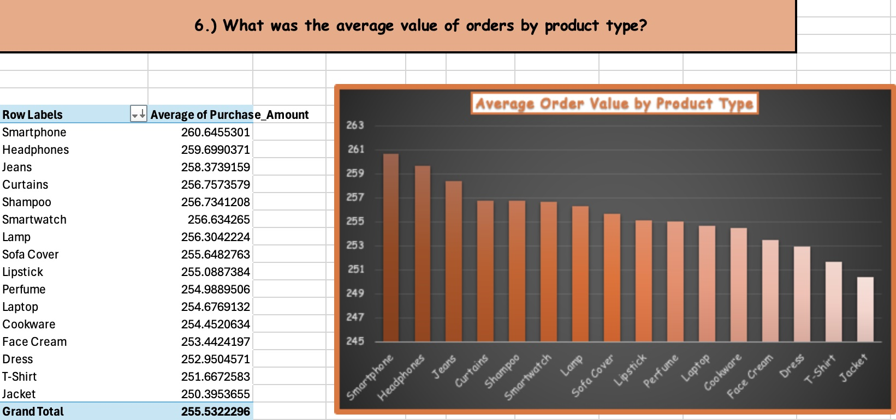
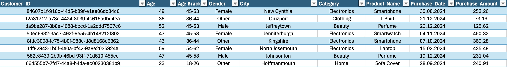
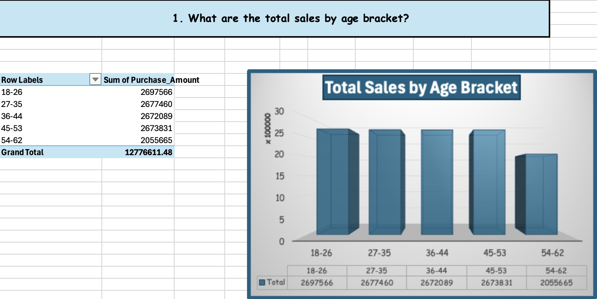
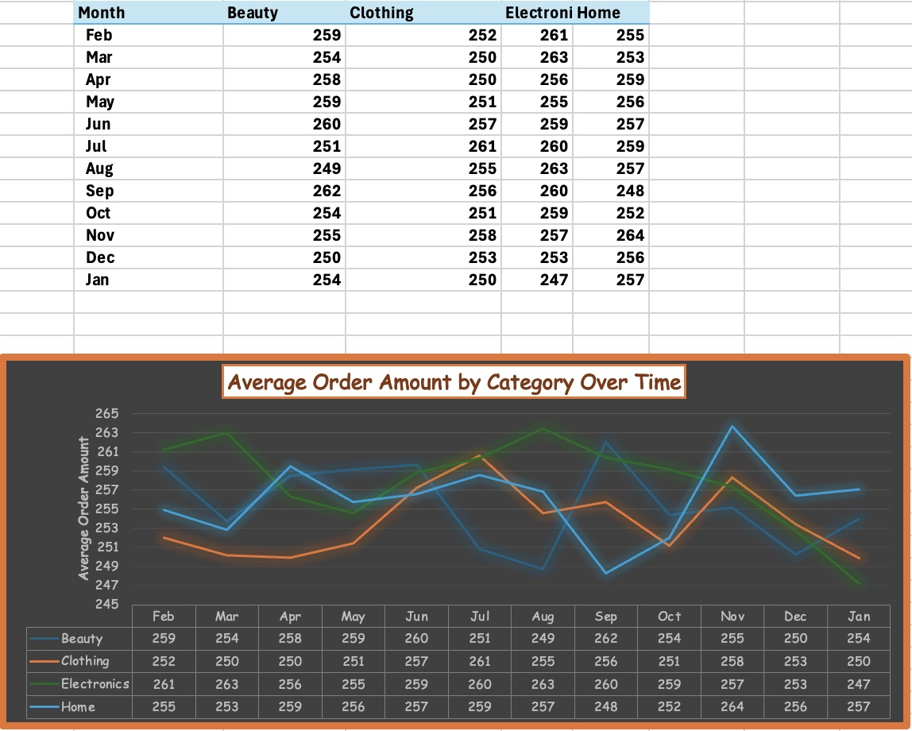
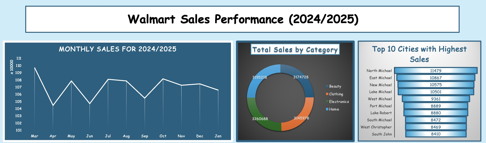
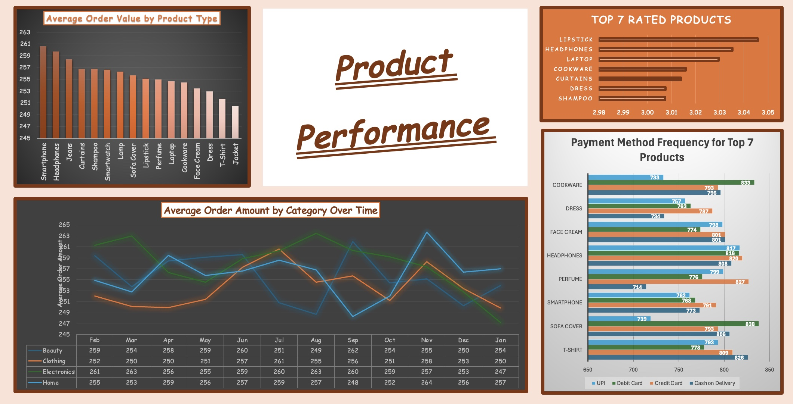
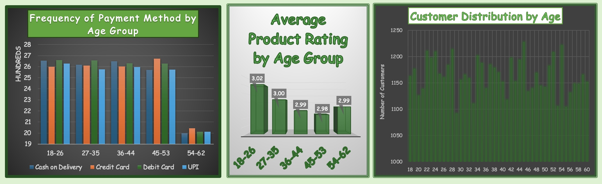

# Excel in Aisle 5: Walmart Analytics on a Budget

Sometimes, less really is more — especially in Excel. In this project, I dive into a lean yet telling dataset simulating Walmart customer behavior. With limited fields and a dash of creativity, I assembled a full suite of analysis, KPI summaries, and dashboards to extract insight from the everyday. The goal? Show how even smaller datasets can pack a big punch when paired with the right structure and logic.

  

The limited fields in the original dataset challenged me to get creative in connecting variables to highlight relationships and connections between them. At the same time, I was able to really explore the details in more depth than datasets that might be overwhelming in terms of variables. From cleaning and analysis to visualization, this project hits the core elements of EDA and business intelligence — all in Excel.

  

The data for this project was obtained from [this Kaggle dataset](http://kaggle.com/datasets/logiccraftbyhimanshi/walmart-customer-purchase-behavior-dataset) and then cleaned, organized, analyzed and visualized.

## Table of Contents

## Table of Contents

- [I. Included Files](#i-included-files)
- [II. Included Datasets](#ii-included-datasets)
- [III. Refining the Data](#iii-refining-the-data)
- [IV. Pinpointing Data Relevance](#iv-pinpointing-data-relevance)
- [V. Dashboards: Who, What, When and Where](#v-dashboards-who-what-when-and-where)
- [VI. Tools Used](#vi-tools-used)
- [VII. Conclusion](#vii-conclusion)
- [VIII. Contact Info](#viii-contact-info)

## I. Included Files

- Walmart Customer Purchases Dataset - Cleaned (walmart_customer_purchases_cleaned.xlsx)
	- Sales Performance DB
	- Product Performance DB
	- Customer Demographics DB
	- Analysis
	- Walmart Customer Purchases (Dataset)
- Walmart Customer Purchases Dataset - Original (online_us_sales_dataset_OG.csv)

## II. Included Datasets

- walmart_customer_purchases_cleaned.xlsx

The dataset is available in its cleaned as well as original form. 

## III. Refining the Data

The dataset was fairly clean from the start, but still needed formatting tweaks — from standardizing column types to engineering a few new features (like age brackets).Here’s a snapshot of how those changes looked in action.

  

These changes enhanced the analytical resolution of the dataset, making it ready for pivot table manipulation, KPI analysis, and executive summaries.

## IV. Pinpointing Data Relevance

This project proves that small datasets can still yield high-value insights — when paired with sharp questions and targeted KPIs. In compiling questions for analysis, I pinpointed areas that would be vital in determining the effectiveness of KPIs. This process included determining three areas of interest that would later be compiled into dashboards. The business questions can be found under the "Analysis" worksheet, and is color-coded for easier navigation (see below). For instance, below is a chart and graph breaking down sales by age bracket.

  

The main areas of concern are listed as follows:

- 🔵 Sales Trends and Insights 
- 🟠 Product Insights  
- 🟢 Customer Demographic Insights 

I aimed to provide concentrated bits of information that could then be digested by specific departments, each having their own role to play in the enterprise. While sales might be related to general management and business, products would concern those handling logistics or vendors while the demographic breakdown would be helpful for targeted advertisements or markets to explore. One notable limitation: the dataset’s synthetic nature sometimes caused overly uniform distributions — but that only made uncovering nuance more rewarding. One such example: the average order value by category, month over month (see below).

  

From here, I worked on converting my findings into clear and informative dashboards for the relevant audiences.

## V. Dashboards: Who, What, When and Where

Great visuals mean little without the right audience in mind. Here, I built dashboards aimed at three distinct business functions: sales, product performance, and customer insights.

I start by addressing "Sales Performance" in the dataset, both overall and by pinpointing pertinent details to make sense of sales over time. The main focus in this dashboard are monthly sales, sales by age bracket, sales by category, cities with the highest sales and how first time and repeat customers compared to one another in sales month by month. Part of that dashboard can be seen here, and the full dashboard is available in the Excel file.

  

From here, I delved into the actual "Product Performance," using metrics to make more informative graphs that demonstrate how products and categories fared against one another. As is the theme with this project, I aimed to make more complex and detailed charts and graphs that tell a larger story. In this regard, my areas of focus were the average order value by product type, average order amount of categories month by month, the highest rated product types and, building on that, the distribution of payment methods for these top product types. The dashboard for this can be seen below.

  

The final dashboard worked on adding depth and precision to the conclusions drawn from the ones mentioned above. Each dashboard speaks to a different stakeholder — but the overlap in insights reveals how collaboration across departments can drive better business decisions. This phenomenon would frequently lead to further collaboration and cooperation, a key staple of many strong businesses. The primary concerns of this dashboard are total sales by gender over time, first time versus repeat customer sales over time, the frequency of payment method by age group, the average product rating by age group and the customer distribution by age. A section of that dashboard is visible here.

  

Ultimately, this is a project that proves the best preparation is oftentimes collaboration. While the actual dataset was relatively small on variables, a bit of hard work -- and quite a bit of coffee -- can help bring those business interests together. 

## VI. Tools Used

- Excel 

## Conclusion

While technical skills are key for any analyst, I wanted this project to emphasize something deeper: knowing what matters, who it matters to, and how to communicate it clearly.

The other key element -- and one of the reasons Excel was chosen for this project -- was that a great deal can be achieved with just a small chunk of data. While big data gets the headlines, this project reminds us that Excel — in the right hands — is still a powerful tool for sharp, efficient analysis. On top of this, I really wished to show how smaller groups of information can be very insightful when combined with Excel's multi-functionality and its wide array of features. 

## VIII. Contact Info

[Linkedin](www.linkedin.com/in/jacob-maze-8a4a0772)

[Tableau Public](https://public.tableau.com/app/profile/analyticsbyjake)

[GitHub](https://github.com/AnalyticsByJake)

[Website]

